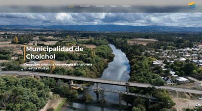

# 🌐 Rediseño del Sitio Web Municipalidad de Cholchol

## 🧪 Evaluación II – Desarrollo Front End  
**Sección 51**  
**Profesor:** Víctor Zapata  

### 👨‍💻 Desarrolladores:
- Carlos González  
- Amanecer Cabrera  
- Emerson Ramírez  


## 🧠 Planteamiento de la problemática

El sitio web actual de la Municipalidad de Cholchol presenta importantes deficiencias en diseño visual, interactividad y responsividad, dificultando la navegación en distintos dispositivos. Esto impacta negativamente en la experiencia del usuario y la imagen institucional.

Se hace necesario rediseñar la página de inicio aplicando buenas prácticas de desarrollo frontend, incorporando eventos, validaciones, accesibilidad y el uso de un framework moderno.

---

## 🧩Desarrollo de eventos de interacción

- Scroll automático a secciones con `useRef`.
- Menú hamburguesa funcional en móviles mediante `Drawer` de MUI.
- Control del menú desde el componente `Layout`.


## 📝  Formulario de contacto con validaciones  

- Validación de campos vacíos (nombre y email).
- Validación de formato correcto de email.
- Modal de confirmación previa al envío con resumen de datos.
- Al confirmar, mensaje dinámico con nombre y email ingresado.


## 🖼️  Implementación de Framework y diseño responsivo

Tecnologías utilizadas:
- ⚛️ React + Vite
- 💄 Material UI (MUI)
- 🧭 React Router DOM
- 🎨 React Icons
- 🧪 Git y GitHub para control de versiones

El diseño se adapta correctamente a dispositivos móviles y de escritorio.


## 🧱 Estructura del proyecto y patrones aplicados

**Framework:** React + Material UI  
**Patrón de diseño:** Arquitectura basada en componentes  

## 👁️ Preview
<p align="center">
  
</p>


## <a href='https://municipalidad-cholchol-front-end.netlify.app'>🌐 Despliegue<a>

## Pasos de instalacion

1. Clonar repositorio
```bash
git clone https://github.com/EmeRamirez/react-mui-ev2.git
```

2. Instalar dependencias
```bash
npm install
```

3. Correr el proyecto
```bash
npm run dev
```
